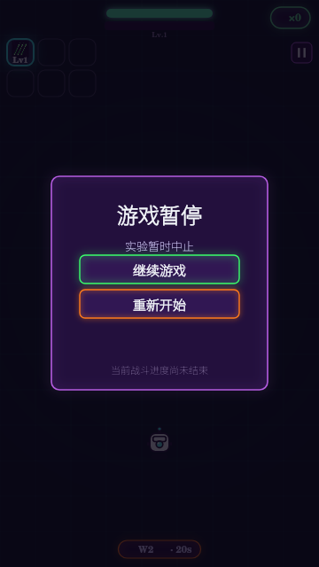
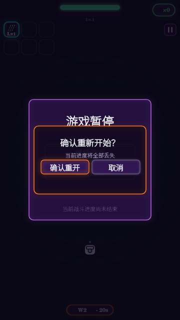
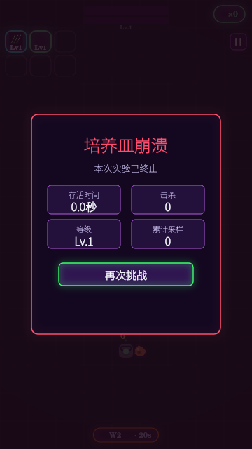
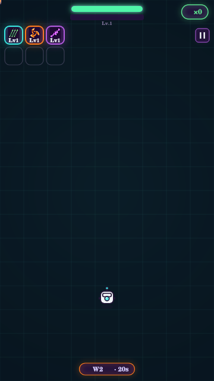

# 图标与战斗状态 UI：评审记录

基线：541fd3066963ebdc94b092e6d705dc9c83bb1c65。

分工：Space Bunny Free（OpenCode）实现代码；Codex 生成图标并负责评审。独立分支，不合并主分支。

## 图标

- `assets/icons/blade.png`：离心刃，橙色 #FF7A1A，三尖旋刃与暗色中心开口。
- `assets/icons/arc.png`：培养电弧，紫色 #B45BE0，折线闪电连接两个电极。
- 生成方式：内置 imagegen；原始高分辨率 PNG；新版 HUD 由 Canvas 显示为 19×19 逻辑像素。尚非规范中的 96×96 发布导出版本，后续应按实际小尺寸验收并优化文件体积。

提示词共用约束：霓虹像素实验室游戏图标；大像素块、阶梯轮廓、少细节；缩至 22×22 仍可识别；深紫描边 #241638、深紫背景 #1A0B2E；主体约占 78%；禁止文字、水印、边框面板和额外物体。

## 范围

图标接入、暂停/继续/重开确认、死亡冻结与四项统计、再次挑战重置、最小提示队列、暂停期间计时冻结。保留现有纵排三选一，不改变构筑或刷怪数值。没有主菜单，暂不增加返回主菜单入口。

## 验收边界

远程验收浏览器无法访问本地服务器。本轮使用 Node + Canvas 检查绘制和状态逻辑；这些检查不能替代真实手机浏览器的触控、字体、DPR 与帧率验收。

## 实际检查结果

- JavaScript 语法与模块初始化：通过。
- 暂停冻结敌人/生命/冷却/计时，并清零摇杆：通过。
- 重开确认取消、继续游戏：通过。
- 提示计时在模态期间冻结：通过。
- 升级时世界与计时冻结：通过。
- 死亡当帧停止拾取，死亡后世界与计时冻结：通过。
- 再次挑战重置生命、等级、样本、待升级、技能与提示：通过。
- `git diff --check`：通过。

发现并修复：生命常量声明顺序导致启动异常；死亡当帧继续拾取样本。两项均由太空兔修改实现。

布局参考（Node Canvas 渲染，不是真机截图）：

未完成：真机触控与帧率验收；96×96 发布图标导出与资源压缩；样本容器、进化分支图标（issue #2）；完整双描边发光和静态缓存优化。不要据此关闭全部美术 issue。

## 与最新玩法合并

已由太空兔适配主分支 a9c0597（WaveDirector + 构筑决策 A–E）。保留波次投放、不补怪、器官、专精、战术增益、分支和下一波预告。

重开新增检查：器官、专精累计、限时增益和敌人数组清零；波次回到第一波起点。状态检查与初始化再次通过。实际 19px 图标已完成 Canvas 缩小辨识检查：橙色旋刃与紫色电弧可区分；仍需手机浏览器复核。

